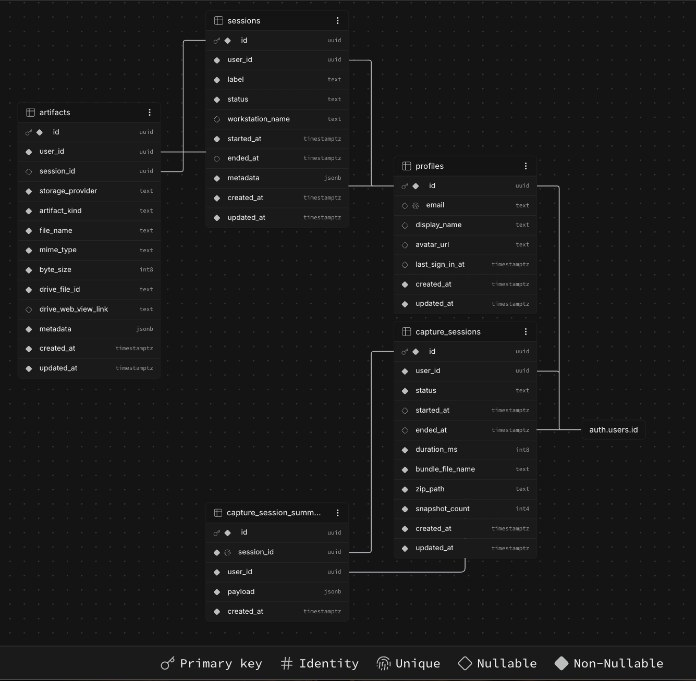
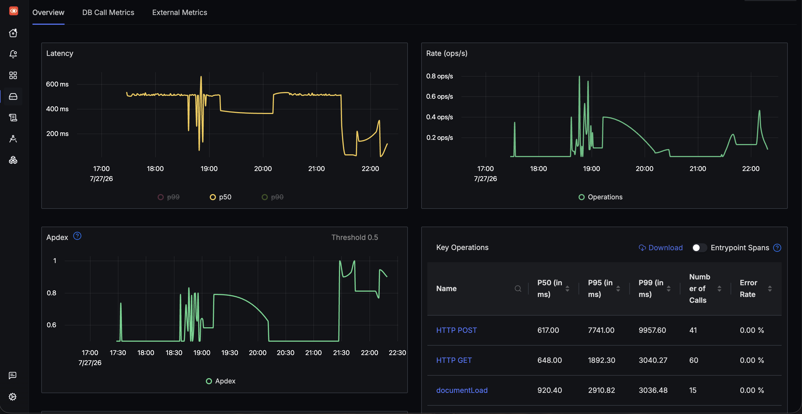
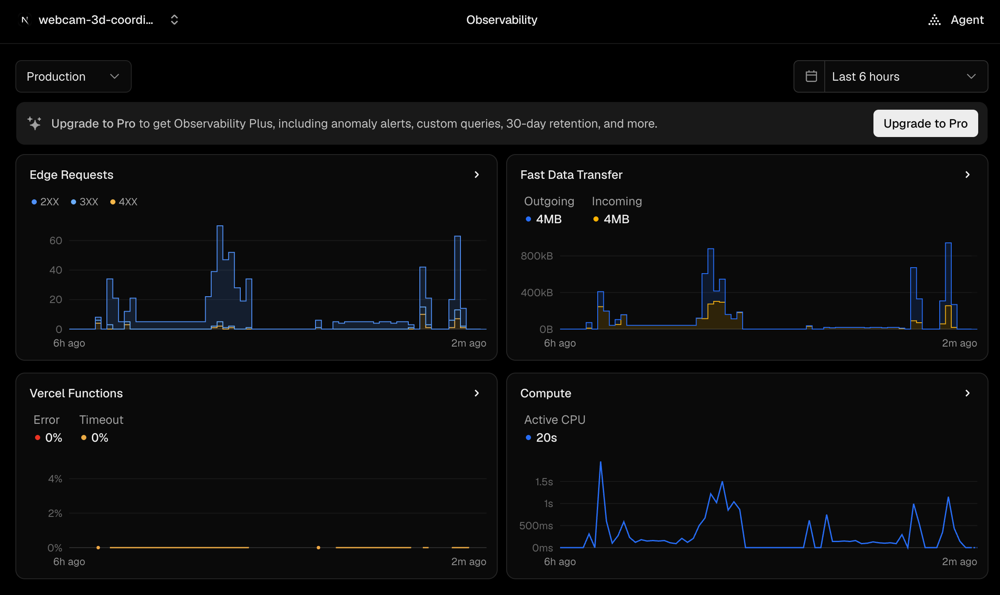

# webcam-3d-coordinate-capture-observability

[](https://nextjs.org/)
[](https://react.dev/)
[](https://www.typescriptlang.org/)
[](https://supabase.com/)
[](https://opentelemetry.io/)
[](https://signoz.io/)
[](https://vercel.com/)

Entry-level portfolio project built to production-grade standards: a browser-based, real-time multi-person coordinate capture and analytics platform with a custom OpenTelemetry ingestion path, Supabase-backed session persistence, and secure same-origin telemetry proxying to a self-hosted SigNoz deployment.

## Video Demonstration

<video src="./docs/media/webcam-3d-coordinate-capture-demo.mp4" width="100%" controls muted playsinline></video>

> **Note:** This walkthrough demonstrates the complete end-to-end system:
>
> 1. **Live Application:** Real-time CV capture, ZIP bundle generation, and successful Google Drive sync.
> 2. **Data Persistence:** Verification of the Supabase Postgres schema and storage bucket policies.
> 3. **Observability:** Proof of live telemetry routing via the custom proxy, confirmed on the SigNoz and Vercel dashboards.

## Project Summary & Architecture

This repository contains a full-stack web application for real-time webcam-based human landmark capture, session archiving, analytics review, and operational telemetry. The current production path is implemented in **Next.js App Router** with a **client-side MediaPipe WebAssembly vision pipeline** derived from the project’s earlier MediaPipe Holistics exploration, while the original Python/Docker research backend has been preserved separately in [`research_engine/`](./research_engine).

The architecture deliberately separates three concerns:

1. **Capture and inference**
   - The webcam capture flow runs in the browser using MediaPipe WebAssembly.
   - Frame-level analytics and timed snapshots are generated only during active capture sessions.
   - Session bundles are assembled client-side and can be downloaded locally or uploaded to Google Drive.

2. **Persistence and product workflow**
   - **Supabase Auth** handles operator authentication and session protection.
   - **Postgres + Storage** persist the most recent five archived sessions per user.
   - A strict per-user retention policy is enforced with an LRU-style cleanup path to remain within free-tier constraints.

3. **Observability and operational telemetry**
   - OpenTelemetry traces, logs, and metrics are emitted from both server and browser contexts.
   - Browser telemetry does **not** call the collector directly.
   - A custom Next.js proxy at `/otel/v1/*` forwards OTLP payloads to a self-hosted SigNoz collector running on a GCP VM, masking infrastructure details from the client.

### High-Level Request/Data Flow

```text
Browser Webcam + MediaPipe WASM
        |
        +--> Live overlay + analytics buffering
        |
        +--> ZIP bundle + snapshots
        |        |
        |        +--> local download / Google Drive upload
        |        +--> Supabase Storage (zip + snapshots)
        |
        +--> Browser OTel exporters
                 |
                 v
        Next.js /otel/v1/* proxy
                 |
                 v
        SigNoz OTLP collector on GCP VM (4317/4318)

Next.js server runtime
        |
        +--> @vercel/otel traces
        +--> custom logs + metrics
        +--> /api/health proof endpoint
        |
        +--> SigNoz collector
```

### Database Schema

The relational model is designed to support multi-session tracking, artifact management, and efficient analytics buffering while maintaining strict user data isolation via Row-Level Security (RLS) policies.



### Delivery Model

- **Application runtime:** Vercel-hosted Next.js deployment
- **CI/CD:** Git-driven Vercel deployment flow
- **Telemetry backend:** Dockerized SigNoz Community deployment on Google Cloud Compute Engine
- **Identity and storage:** Supabase Auth, Postgres, and private Storage buckets
- **Transactional email:** Supabase Auth email templates with Google SMTP delivery

## Observability & Telemetry Deep Dive

The observability subsystem is a first-class part of the project rather than an afterthought. The implementation combines framework-native tracing with custom logging/metrics and a hardened transport path.

### Why the custom OTLP proxy exists

The browser cannot safely publish telemetry directly to the GCP collector endpoint:

- it would expose the VM public IP in shipped client code,
- it would require permissive CORS handling on the collector,
- and browser requests could accidentally include authentication context that should never reach telemetry infrastructure.

To address this, the application uses a **same-origin OTLP relay**:

- Browser exporters send traces, logs, and metrics to:
  - `/otel/v1/traces`
  - `/otel/v1/logs`
  - `/otel/v1/metrics`
- These requests terminate inside the **Node.js runtime** of the Next.js app.
- The proxy validates the signal, forwards only safe headers, strips `Cookie` and `Authorization`, and relays the raw OTLP body to the collector.
- If the collector is unavailable, the proxy returns a non-fatal response (`202`) to avoid aggressive browser retry storms degrading UX.

### Telemetry implementation details

- **Server tracing:** `@vercel/otel` bootstrapped in `frontend/instrumentation.ts`
- **Server metrics/logs:** custom providers in `frontend/lib/observability/server.ts`
- **Browser telemetry:** OTLP web exporters initialized in `frontend/lib/telemetry/client.ts`
- **Secure forwarding:** `frontend/lib/observability/proxy.ts`
- **Ingress routes:** `frontend/app/otel/v1/[signal]/route.ts`
- **Proof endpoint:** `frontend/app/api/health/route.ts`

### What is tracked

- **Traces**
  - App Router server activity
  - API route execution
  - browser-side user navigation and fetch/XHR spans

- **Metrics**
  - `api_requests_total`
  - browser page view counters
  - custom telemetry event counters

- **Logs**
  - structured server events correlated with active trace/span context
  - browser-side telemetry events routed through OTLP logs

### Dashboarding approach

The SigNoz setup is intended to answer both product and infrastructure questions:

- Is the Next.js app serving routes successfully?
- Are telemetry exporters reaching the collector?
- Are trace IDs and log records correlated correctly?
- Is the custom OTLP proxy amplifying noise, or can relay traffic be filtered out from business-level analysis?

The current dashboard strategy includes:

- custom charts for `api_requests_total`,
- trace and log inspection for the `/api/health` proof route,
- browser telemetry visibility through the same-origin relay,
- filtering of low-signal proxy traffic/heartbeat noise to keep operational panels readable.

**SigNoz Observability Dashboard:**


**Vercel Production Deployment:**


## Folder Structure

```text
.
├── frontend/                     # Next.js App Router application
│   ├── app/                      # Route tree: dashboard, capture, analytics, auth, API, OTLP relay
│   ├── components/               # UI, dashboard surfaces, auth flows, providers
│   ├── lib/
│   │   ├── analytics/            # Session buffering, ZIP assembly, archive lifecycle, Supabase sync
│   │   ├── auth/                 # Client auth helpers and pending verification utilities
│   │   ├── google/               # Google Drive upload integration
│   │   ├── observability/        # OTel server bootstrap, proxy forwarding, shared config
│   │   ├── supabase/             # Browser/server Supabase clients and environment helpers
│   │   └── telemetry/            # Browser-side OTLP exporters and page/event instrumentation
│   ├── instrumentation.ts        # @vercel/otel registration entrypoint
│   ├── next.config.js            # Next.js runtime configuration
│   └── package.json              # Frontend dependency and script manifest
├── research_engine/              # Archived Python/Docker CV R&D pipeline preserved for reference
│   ├── backend/                  # Legacy backend service and Dockerfile
│   ├── multiperson_*             # Early multi-person CV experiments
│   ├── calibration_*             # Research calibration assets and evaluation data
│   └── README.md                 # Context for the archived research pipeline
├── supabase/
│   └── migrations/               # SQL schema, RLS policies, and bucket setup for session persistence
└── README.md                     # Repository overview and architecture documentation
```

## Local Setup & Development

### Prerequisites

Before running the project locally, ensure the following are available:

- **Node.js 20+**
- **npm**
- **Supabase project** with Auth, Postgres, and Storage enabled
- **Docker Desktop / Docker Engine** if you want to run a local SigNoz stack
- **Google Cloud / Google OAuth credentials** for Drive integration
- **Google SMTP configuration** if you want Supabase Auth emails to use Gmail-hosted SMTP delivery

> **Note:** The SigNoz deployment used in production is external to this repository. For local observability development, use the official SigNoz Docker installation and point the OTLP environment variables at your local or remote collector.

### 1. Clone the repository

```bash
git clone https://github.com/aryanbhardwaj24/webcam-3d-coordinate-capture-observability.git
cd webcam-3d-coordinate-capture-observability
```

### 2. Install frontend dependencies

```bash
cd frontend
npm install
```

### 3. Configure environment variables

Create a local environment file from the example:

```bash
cp .env.local.example .env.local
```

Populate the application variables:

```env
NEXT_PUBLIC_SUPABASE_URL=https://your-project.supabase.co
NEXT_PUBLIC_SUPABASE_PUBLISHABLE_KEY=your-supabase-publishable-key
NEXT_PUBLIC_GOOGLE_CLIENT_ID=your-google-oauth-client-id

OTEL_EXPORTER_OTLP_PROTOCOL=http/protobuf
OTEL_EXPORTER_OTLP_ENDPOINT=http://your-signoz-host:4318
OTEL_EXPORTER_OTLP_TRACES_ENDPOINT=http://your-signoz-host:4318/v1/traces
```

Additional environment and platform configuration used by the application:

- `SUPABASE_SERVICE_ROLE_KEY`
  - required for server-side administrative flows such as unverified account cleanup
- Supabase Auth email templates and SMTP settings
  - configure **Google SMTP** in Supabase if you want end-to-end email verification flows locally or in staging
- Supabase Storage buckets
  - `raw-bundles`
  - `snapshots`

### 4. Apply Supabase schema

Run the SQL in [`supabase/migrations/phase8_capture_sessions.sql`](./supabase/migrations/phase8_capture_sessions.sql) against your Supabase project, or apply it through your preferred Supabase migration workflow.

This migration creates:

- `capture_sessions`
- `capture_session_summaries`
- private storage buckets for archived ZIP bundles and snapshots
- row-level security policies restricting access to a user’s own data

### 5. Run the development server

```bash
npm run dev
```

The application will be available at:

```text
http://localhost:3000
```

### 6. Optional: run local verification commands

```bash
npm run lint
npm run build
```

## Engineering Notes

- **Session retention:** capped to the newest five archived sessions per user
- **Storage strategy:** lightweight summaries in Postgres, heavy artifacts in Supabase Storage
- **Security model:** RLS-protected Postgres rows and storage object paths scoped by `auth.uid()`
- **Telemetry hardening:** OTLP collector endpoints remain server-only; browser traffic uses a same-origin proxy
- **Operational proof:** `/api/health` verifies traces, logs, and metrics in a single route

## Reviewer Notes

For hiring managers and senior engineers skimming this repository:

- The primary architectural signal is the **separation between product logic and observability transport**.
- The project intentionally demonstrates:
  - client-side Computer Vision execution without a long-running inference backend,
  - authenticated session persistence with bounded storage growth,
  - trace/log/metric correlation using OpenTelemetry,
  - secure telemetry forwarding that avoids exposing collector infrastructure to browsers,
  - production deployment discipline via Vercel and self-hosted observability infrastructure.

## Author

[](https://www.linkedin.com/in/aryanbhardwaj24/)
[](mailto:aryanbhardwaj1328@gmail.com)
[](https://github.com/aryanbhardwaj24)

_Designed and developed by Aryan Bhardwaj._
